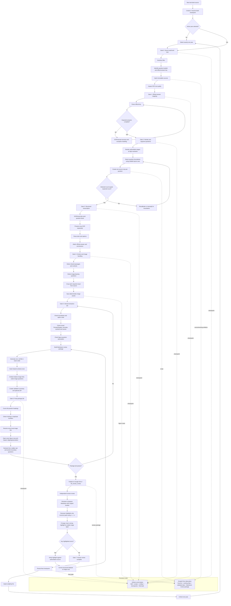

# End-to-End Pipeline

## Non-negotiable invariants

- Process one year at a time.
- Do not start the next year before the active year is complete.
- Original sources are immutable.
- Official answer keys are preferred over model inference.
- OCR is a draft, not verified truth.
- Every image-bearing question must preserve the required source visual.
- The canonical human-review deliverable is Markdown plus relative image assets.
- The Markdown package must be reopened and validated before publication.
- Human review remains minimal: highlight only errors; no forms or status tables.